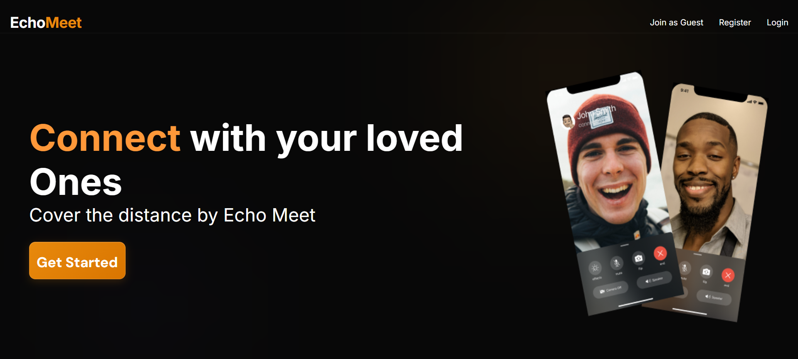
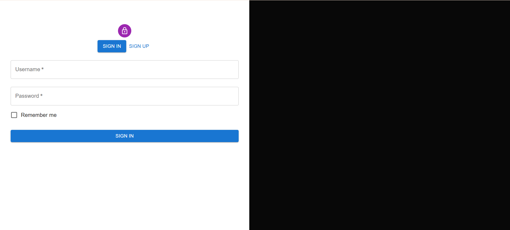
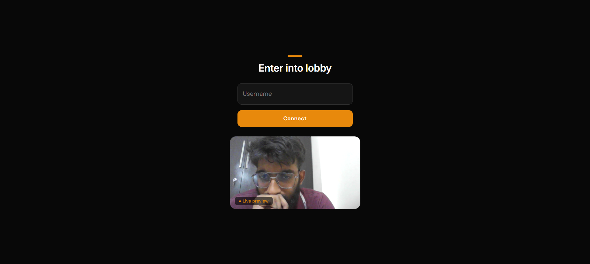
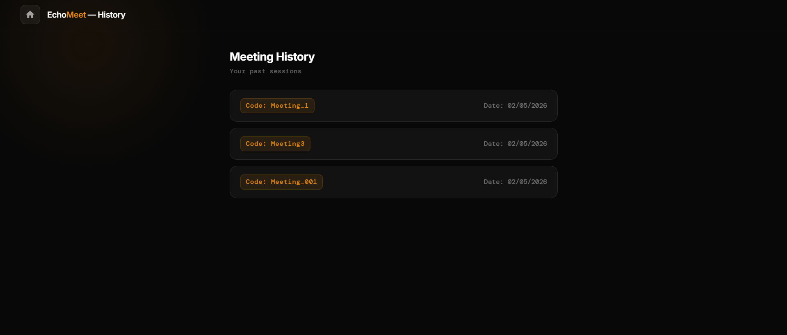

# EchoMeet 🎥

> **Connect with your loved ones — Cover the distance by Echo Meet**

EchoMeet is a full-stack MERN video calling web application that allows users to join meetings via unique meeting codes, preview their camera before connecting, and review their meeting history — all in real time.

---

## ✨ Features

- **Landing Page** — Clean hero section with call-to-action to get started
- **Authentication** — Sign In / Sign Up flow with username & password
- **Meeting Dashboard** — Join any meeting using a unique meeting code
- **Lobby Preview** — Live camera preview before entering a meeting room
- **Meeting History** — View a log of past sessions with meeting codes and dates
- **Guest Access** — Join as a guest without registering

---

## 📸 Screenshots

| Page | Description | Screenshots |
|------|-------------|-------------|
| Home | Hero landing page with "Get Started" CTA |  |
| Login | Sign In / Sign Up with username & password |  |
| Dashboard | Join meeting via code input |  |
| Lobby | Live camera preview before connecting |  |
| History | View past meeting sessions |  |

---

## 🛠️ Tech Stack

### Frontend
- **React.js (Vite)** — UI components and routing
- **WebRTC** — Peer-to-peer video/audio streaming
- **Socket.IO Client** — Real-time signaling

### Backend
- **Node.js** — Runtime environment
- **Express.js** — REST API server
- **Socket.IO** — WebSocket signaling server (socketManager.js)

### Database
- **MongoDB** — Storing users and meeting history
- **Mongoose** — MongoDB object modeling

---

## 📁 Project Structure

```
echomeet/
├── backend/
│   ├── src/
│   │   ├── config/
│   │   │   └── db.js                  # MongoDB connection
│   │   ├── controllers/
│   │   │   ├── socketManager.js       # Socket.IO event handlers
│   │   │   └── user.controller.js     # User logic (register, login)
│   │   ├── middlewares/
│   │   │   └── verifyToken.js         # JWT auth middleware
│   │   ├── models/
│   │   │   ├── meeting.model.js       # Meeting schema
│   │   │   └── user.model.js          # User schema
│   │   ├── routes/
│   │   │   └── user.routes.js         # Auth & user routes
│   │   └── utils/
│   │       └── generateJWT.js         # JWT token generator
│   ├── app.js                         # Express app entry point
│   ├── .env
│   └── package.json
│
└── frontend/
    ├── public/
    ├── src/
    │   ├── assets/
    │   ├── pages/
    │   │   ├── authentication.jsx      # Sign In / Sign Up page
    │   │   ├── history.jsx             # Meeting history page
    │   │   ├── home.jsx                # Dashboard (join meeting)
    │   │   ├── landing.jsx             # Landing/hero page
    │   │   └── videoMeet.jsx           # Video call room + lobby
    │   ├── utils/                      # Helper functions
    │   ├── App.jsx
    │   ├── App.css
    │   ├── main.jsx
    │   ├── index.css
    │   ├── home.css
    │   ├── history.css
    │   ├── videoComponent.css
    │   └── environment.js             # API base URL / env config
    ├── index.html
    ├── eslint.config.js
    └── package.json
```

---

## 🚀 Getting Started

### Prerequisites

- Node.js (v18 or higher)
- MongoDB (local or [MongoDB Atlas](https://www.mongodb.com/atlas))
- npm or yarn

### Installation

```bash
# Clone the repository
git clone https://github.com/your-username/echomeet.git
cd echomeet
```

#### Setup Backend

```bash
cd backend
npm install
```

Create a `.env` file inside `backend/`:

```env
PORT=5000
MONGO_URI=your_mongodb_connection_string
JWT_SECRET=your_jwt_secret
```

```bash
npm run dev
```

#### Setup Frontend

```bash
cd frontend
npm install
npm run dev
```

Frontend runs at `http://localhost:5173`, backend at `http://localhost:5000`

---

## 📖 How to Use

1. **Register or Login** — Create an account or sign in on the authentication page
2. **Join a Meeting** — Enter a meeting code on the home dashboard and click **Join**
3. **Lobby** — Enter your username and preview your camera, then click **Connect**
4. **In Meeting** — Enjoy your real-time video call via WebRTC
5. **History** — Click the **History** button in the navbar to review past sessions

---

## 🔌 API Endpoints

| Method | Endpoint | Description |
|--------|----------|-------------|
| POST | `/api/users/register` | Register a new user |
| POST | `/api/users/login` | Login and receive JWT token |
| GET | `/api/users/history` | Get user's meeting history (protected) |

---

## 🔒 Authentication

- JWT-based authentication via `generateJWT.js`
- Token verification middleware via `verifyToken.js`
- Protected routes on both frontend and backend
- Guest access available (no registration required)

---

## 🤝 Contributing

Contributions are welcome! Please open an issue or submit a pull request.

```bash
git checkout -b feature/your-feature
git commit -m "Add your feature"
git push origin feature/your-feature
```

---

## 📄 License

This project is licensed under the MIT License. See [LICENSE](LICENSE) for details.

---